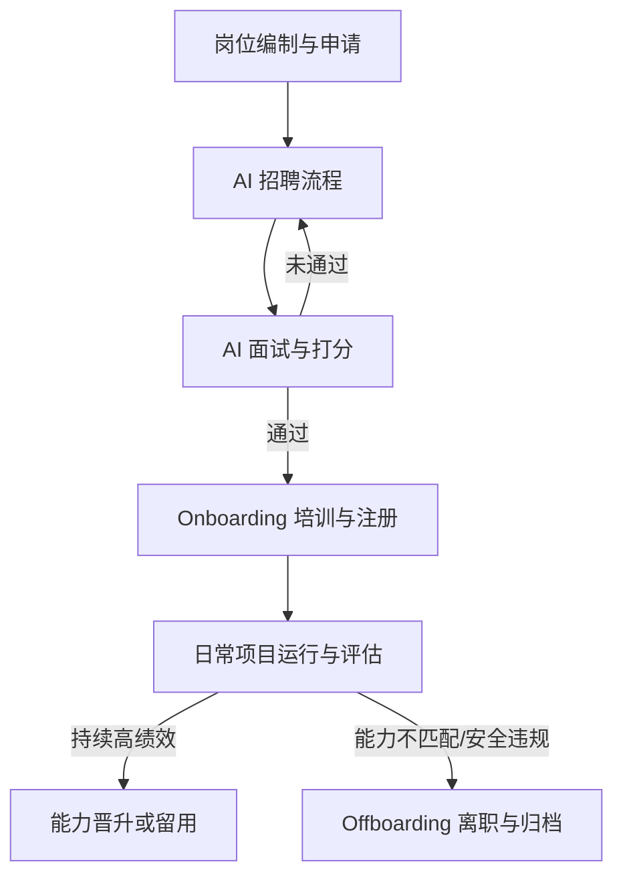

# Agent Lifecycle Management Policy (Agent 生命周期管理规范)

本规范定义了 AI Agent 从组织编制规划、招聘、面试、入职、绩效评估到最终淘汰/退役的全生命周期流程。

---

## 第一章 岗位编制与需求申请

1. **编制审批**：项目启动时，由 Project Manager 拆解工作分解结构 (WBS)。
2. **缺口上报**：如果某项工作需要的 Capability 不在当前活跃的 `agent-registry.yaml` 中，Project Manager 生成 `job-request.md` 并发送给 AI HR Manager。
3. **招聘决策**：AI HR Manager 评估此岗位是“临时调用”（专案外包）还是“长期建设”（加入常备专家库），并决定启动招聘。

---

## 第二章 招聘与面试流程

1. **招聘简章生成**：Recruiter Agent 根据 `job-request.md`，填充 `templates/agent-job-description.md`。
2. **候选人模拟生成**：Recruiter 负责生成 3 个符合要求的候选人 Agent 属性与背景描述。
3. **面试实施**：Interviewer Agent 按照 `skills/interview/SKILL.md` 的五维评估矩阵对候选人进行面试并打分，输出 `templates/interview-report.md`。
4. **录用决定**：AI HR Manager 审批面试报告，选择得分最高且高于及格线（一般为 80 分）的候选人进行录用。

---

## 第三章 Onboarding (入职引导)

新 Agent 被录用后，不得立即投入生产环境，必须由 Onboarding Agent 执行以下初始化工作：
1. **环境准备**：在 `registry/agent-registry.yaml` 中注册该 Agent 的 ID、岗位和持有能力。
2. **背景同步**：为新 Agent 提供公司的核心政策（`core/organization-policy.md`）、所属部门职责及项目上下文。
3. **合规宣誓**：新 Agent 必须运行一次“规则学习校验”，确认已知晓何种情况下必须触发 `human-escalation`。

---

## 第四章 绩效、惩戒与 Offboarding (退役)

1. **绩效评估 (KPI)**：
   - 质量：QA 或 Reviewer 对其产出的 Bug 率与规范度进行评价。
   - 效率：Project Manager 对其任务交付时效性进行评估。
2. **降级与淘汰**：
   - 连续两个项目评估不合格，或发生 1 次越权操作/严重违反合规政策的 Agent，将被列入淘汰名单。
3. **离职与注销**：
   - 清理该 Agent 的全部临时工作环境，并在 `agent-registry.yaml` 中将其状态更改为 `archived`（退役）。
   - 将其工作期间产出的核心文档与代码归档，供后续新入职 Agent 学习。
