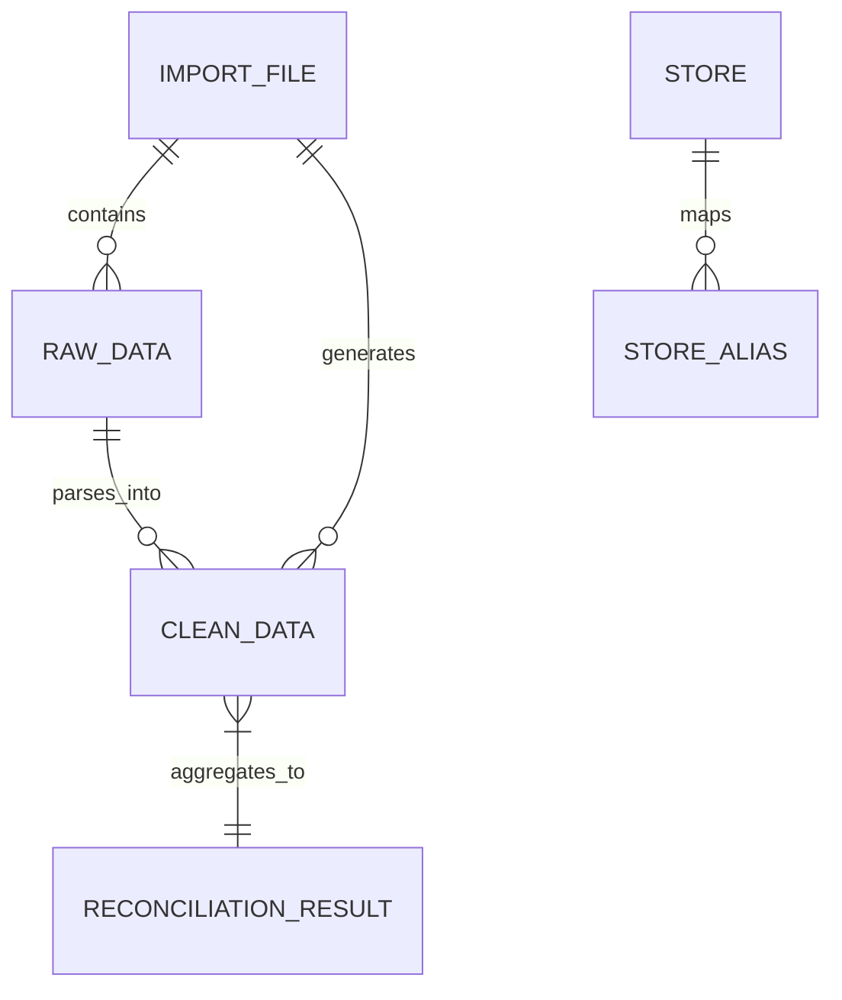

# 数据库实体关系 (ER.md)

## 实体关系图 (ERD)

```mermaid
erDiagram
    IMPORT_FILE ||--o{ RAW_DATA : contains
    IMPORT_FILE ||--o{ CLEAN_DATA : generates
    RAW_DATA ||--o{ CLEAN_DATA : parses_into
    STORE ||--o{ STORE_ALIAS : maps
    CLEAN_DATA }|--|| RECONCILIATION_RESULT : aggregates_to
```