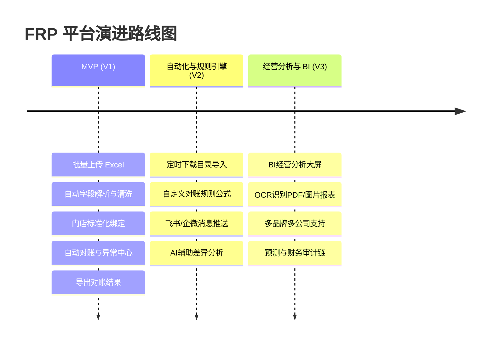

# 开发路线图 (ROADMAP.md)

FRP 的长期发展规划分为三个核心版本里程碑。

```mermaid
timeline
    title FRP 平台演进路线图
    MVP (V1) : 批量上传 Excel : 自动字段解析与清洗 : 门店标准化绑定 : 自动对账与异常中心 : 导出对账结果
    自动化与规则引擎 (V2) : 定时下载目录导入 : 自定义对账规则公式 : 飞书/企微消息推送 : AI辅助差异分析
    经营分析与 BI (V3) : BI经营分析大屏 : OCR识别PDF/图片报表 : 多品牌多公司支持 : 预测与财务审计链
```